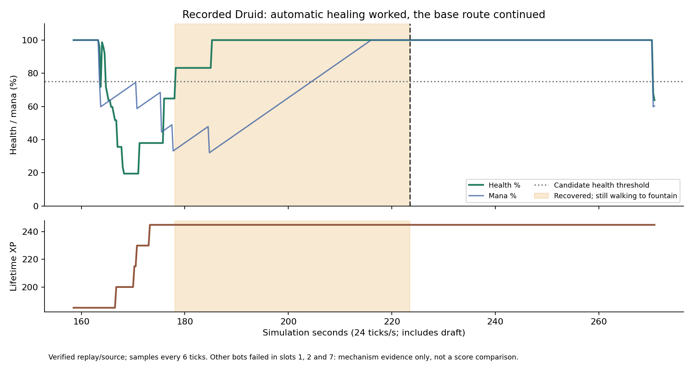

# Verified Druid retreat coaching

The coaching candidate reduced unnecessary retreat movement, but failed its
240-game score comparison. Both league players retain validated blue-center.
The [saved IR/policy pair and results](../../../examples/gods_of_the_arena/players/ir/forks/field-sustain20260923-hosted/README.md)
preserve the tested source and distinguish working behavior from competitive value.

Session `2026-09-23t02-52-57-098ze03810` originally contained no episode or source
binding. The supplied league URL led to the [matching recorded episode](https://softmax.com/observatory/v2?tab=experience-requests&detail=episode-request:ereq_7ad01f93-5ee5-4eca-ba01-a9b7ee9ea658).
Its 22,358 ticks, roster, Aaron's red Druid in slot 4, and HUD sequence match.
The runtime spec identifies core-buyback source `67fdcd5d`, version `30a0e469`.
Full replay hashes and Aaron's VM pass. Other VMs in slots 1, 2 and 7 fail, so
this episode supports the behavior diagnosis, not a competitive comparison.

Automatic self-heals already worked: 55 HP at tick 4105, 80 at 4224, 55 at 4273
and 50 at 4441. At tick 4273 the Druid has 248/298 HP (83.2%); at 4441 it is
fully healed. Its base waypoint persists until fountain arrival around 5364,
**45.46 seconds after exceeding 75% HP**. Outbound advance starts around 5382.
XP stays at 245 through tick 6498. The top-right clock is time of day; playback
scrubbing prevents converting recording seconds into simulation time. The
synthesis's exact 390 maximum HP estimate was incorrect.

Blue-center inherits this Druid retreat latch. The coaching candidate adds
bounded field healing, current danger and resource checks, a short step toward
allied cover, and interruption of health-only retreats after recovery. Extra
explicit healing is not independently supported by the recording, because
automatic healing was already active. The coordinated bundle was tested as a
whole against blue-center under the [frozen experiment](../../../games/gods_of_the_arena/experiments/2026-09-23-field-sustain.md).

All 558 local checks, 12 complete native games and 240 hosted game audits pass.
Mean score nevertheless falls from 1,547.23 to 1,381.23 (**−10.73%**; 95% gain
interval −30.33% to +13.17%). Blue lead, red late and blue late contexts each
miss the required 95% score preservation floor. Rejection follows the original
criteria; it does not establish certain harm in every future matchup.

The 24 diagnostic replays show less healthy homeward travel and more field
healing. Post-hoc class slices differ by color and draft mix; they do not justify
deploying a selected subset. A narrower retreat-interruption hypothesis needs
a fresh test. The original 51 capture files remain byte-identical in the source
session and local copy, with hashes in [the input manifest](session-input-manifest.json).
Empty captured input IR and policy files remain empty.
