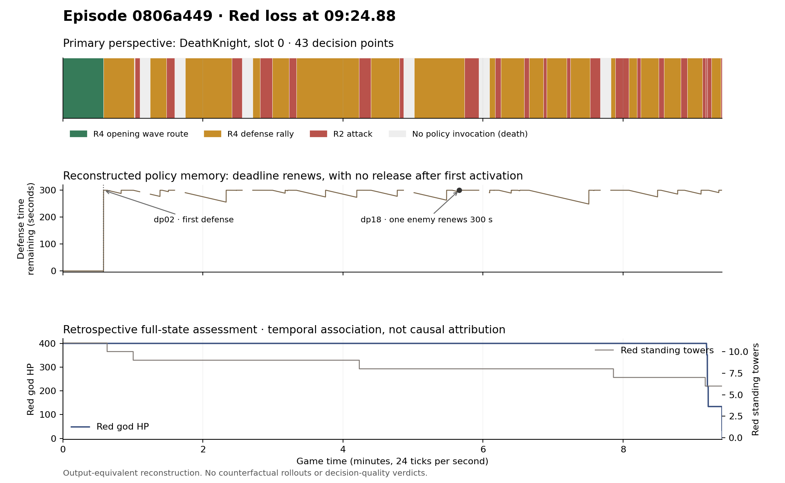

# Coach and autoresearcher handoff

[Full episode IR](episode.ir.md) · [Structured evidence](episode.ir.json) · [Machine-readable proposals](research-handoff.json)

The linked game is a verified **09:24.88 loss** by `aaron-gota-ir-relh154-legacy-0916:v1` against `gota-g002:v1`.
The report follows the primary DeathKnight (slot 0), using **43 decision points**. All five owned instances were checked against the replay.

The most useful observation is in `ereq_0806a449-3d7c-4160-868a-3e157634ebbc.dp18` (ticks 7221–8254). At tick 8150 (05:39.58), the DeathKnight is at (103,9),
sees a living enemy at (94,19), and renews its defense deadline to 15350. That enemy is √181 ≈ 13.45 tiles away, outside the ten-tile defensive intercept radius.
`bestId=0`, so `fallback` issues `walkTo(103,9)`. This explains the no-target rallying in policy terms; it does not establish that leaving would win.
Across this primary perspective, 3,460 ticks extend an existing defense deadline while the current observed group count is below four.
Once defense activates at tick 838, the subject never records an inactive defense state on a later living decision, including after six respawns.

A second activation gap: **all 2,900 target-attack decisions exceed the 40-object defense motion limit**. R2 takes its attack-only budget branch,
and `motionActive` stays zero. The cadence controller does not activate for this hero in this episode. This is a concrete execution condition to investigate,
not proof that enabling cadence in those states would improve the result.

The representation itself needs attention before another parameter search:

1. **Lift the hidden choices in `observe`.** Expose rush recognition, sentry assignment, commitment renewal, target eligibility and release as named concepts with explicit guards. The existing glossary contains only three predicates. [Fourteen proposed glossary entries](proposed-glossary.json) supply grounding and supporting decisions.
2. **Keep multiple channels explicit.** R1 changes target/defense state; R2 and R4 determine locomotion; E0 consumes inventory; E1 and E2 spend resources in order. Purchases accumulate rather than selecting a single winner. Preserve this structure when lifting or embedding.
3. **Give the coach an evidence contract.** A comment should identify a decision ID, the observed objects, the responsible IR block, the proposed intervention and its status. “Release one sentry earlier” is a hypothesis; “the hero was physically stuck” is not established by this trace.
4. **Give the autoresearcher a staged gate.** First require an output-equivalent lift. Then define forceable alternative skills and branch checkpoints containing world, RNG and every live policy's memory. Acquire a valid live g002 policy or equivalent reconstruction before counterfactual verdicts. Evaluate candidates against reacting peers; report intervals and retain failed cases.
5. **Capture semantic traces during play.** Retain version hashes, effective seed, visibility-filtered decision snapshots, memory transitions, rule guards/firings and command ownership. Keep absent confidence null; authored research beliefs are not the policy's per-tick estimates.

Reconstructed fidelity: **43 consistent, 0 inconsistent, 0 unresolvable**; all 85,827 rule evaluations checked.
Original internal fidelity remains unresolvable. All 67,929 owned commands and 13,557 state hashes match, and trace instrumentation preserves observed state and globals.
The five negative material-swing candidates have **no rollouts and no quality verdicts**. Their skill alternatives are not separately exposed by this IR.

These are reviewable evidence proposals. The deployed policy and its evidence were not changed. Another research session has already investigated this replay;
this handoff adds a structured episode account and does not claim those prior trials as new evidence or rerun their rejected experiments.
