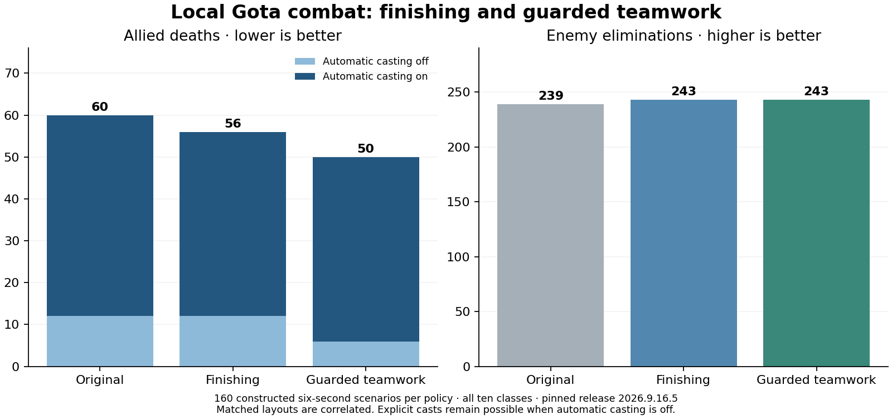

# Gota microplay: individual finishing and cooperative target choice

The new local combat skill reduced allied deaths **60→50** and increased enemy eliminations **239→243** across 160 matched held-out six-second scenarios. Assistance reduced deaths beyond finishing alone, **56→50**. These are constructed encounter results on pinned release 2026.9.16.5, not a live-field or fort-win claim.

| Policy | Enemy eliminations | Allied deaths |
| --- | ---: | ---: |
| Original | 239 | 60 |
| Finishing only | 243 | 56 |
| Finishing + guarded assistance | 243 | 50 |

The skill finishes a wounded visible enemy already inside its conservative reach bound, then considers the target of a nearby lower-ID ally. It keeps self-defense when the current enemy targets self, unless that ally has less than half self's HP. Lower-ID leadership prevents reciprocal target-following loops. Structures and macro choices keep their existing behavior. Crowded observations fall back to the parent to bound VM cost.

Automatic spells matter: unguarded assistance reduced total deaths but caused two extra Crossbowman deaths versus finishing. That variant was rejected. The guard eliminated that regression in fresh scenarios. In the final holdout, the **additional assistance benefit occurred with manual spells** (12→6 allied deaths); with automatic spells, assistance matched finishing (44 deaths each, versus 48 for the original). Do not claim an additional teamwork survival gain in the automatic-spell stratum.

The study covered all ten class assignments on both colors, four encounter families, automatic/manual spells, fixed opponents, and two-subject crossfire. “Manual spells” means automatic casting is disabled; explicit casts from the unchanged parent remain possible. The original plan's suggestion that this isolates basic attacks was too strong. Mirrored colors and repeated trajectories are correlated; no independent-sample significance claim is made. Per-class, family, side and spell-mode counts are in the [research IR](research.ir.json). Raw public observations, per-tick world hashes, VM decisions, outcomes, frozen plans and failed experiments are retained under [evidence](evidence/).

An explicit units correction is retained: the engine uses 60,000 world units per tile. The earlier range expression accidentally used 60% of true reach. The final binding names this measured 60% setting and preserves its behavior, verified against **480 encounters / 69,120 tick hashes**. Wider reach is untested. The first inactive experiment and this explanation error remain in the lineage.

All original 1,864 experimental rollouts were repeated with exact observation/decision/state output. The final binding additionally matched 480 of those encounters after the units/budget refinement. Fifteen focused tests pass. **10 final normal games** completed with exact action replays and no VM errors; peak instructions were **17707/20000**. Those games activated **0 refinements**, so they establish runtime compatibility and baseline behavior only. Their repeated trajectories provide limited coverage.

Use the [evaluated executable policy IR](../../../examples/gods_of_the_arena/players/ir/forks/microplay/policy.ir.json), [generated BASIC](../../../examples/gods_of_the_arena/players/ir/forks/microplay/policy.bas), [action-level semantic records](decisions.ir.jsonl.gz), and [reproduction tools](../../../games/gods_of_the_arena/instruments/microplay/README.md). The policy and research each use situation, belief, goal, skill, strategy, execution and update layers. Live champions and the existing research daemon were not changed.
