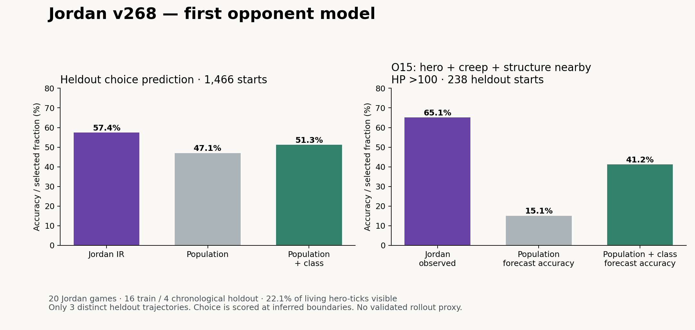

# Jordan v268 — individual opponent IR

Native Python artifact: [`jordan_v268.py`](../../../examples/gods_of_the_arena/players/ir/opponents/jordan_v268.py). Same seven-layer dictionaries and `id / when / skill / for` rule records as the primary IR; inference binding `gota-observer-model/1`. No executable equivalence to Jordan is claimed.

**Initial result:** 57.4% heldout motif-choice accuracy versus 47.1% population and 51.3% class-conditioned population. Three preferences clear the stated heldout baseline gate. No strategy edit or proxy is qualified for adoption.



## 1. Header

- **Identity:** `Jordan-ply_bcb80069-fb0c-4ba5-a45c-06b647870aeb:v268`; version UUID `207ffaf9-0d1e-4d92-a15d-4352f1bddec2`. Individual model; no pooling across Jordan versions.
- **Snapshot:** rank 1 in the fetched league leaderboard, MMR 1802.17. League `league_3c60897b-25cf-4b37-9d1a-8554c1198f28`; completed rounds 483–502.
- **Episodes:** 20 Jordan games, 2026-09-19 17:17:58 to 2026-09-20 03:27:04 UTC (September 19 local). All 20 were Jordan wins. Outcomes did not select the sample.
- **Split:** earliest 16 training / latest 4 heldout, frozen before behavior inspection. Training reduces to 11 distinct visible trajectories. Heldout has 3 distinct trajectories; two episodes exactly repeat a training trajectory. The remaining two episodes are new observable trajectories, not evidence of broad seed diversity.
- **Observer:** one real owned policy instance, slot 0 or 5. Both owned deployments use `gota_relh154_legacy`, `gota-semantic-policy/1`; [frozen policy](observer-policy.ir.json). Canonical SHA `8e4eb95f2cd8a9dd2702a5b4e13a7ceb541db803e04c70cea11b33bf5839ce37`.
- **Visibility:** 200,988/907,699 living opponent hero-ticks visible (22.1%); 19.7% of all five scheduled hero-ticks. Observer dead on 14.7% of ticks. No enemy trajectories are filled through these gaps.

## 2. Skills

All seven are `[inferred-skill]` motifs, not recovered source functions. The existing `attack` skill executes `defense_cadence`, so it is deliberately not equated with an observed target. Targeting and movement can coexist: primary motif records a visible target first and retains a concurrent movement histogram. These categories do not assert single-rule execution.

| Skill | Definition | Distinct-train starts | Median ticks | Heldout recall |
|---|---|---:|---:|---:|
| `target_hero` | Visible target identifies a living hostile hero; pursuit/retained target, not proof of an attack or kill. | 1690 | 14.0 | 99.2% |
| `target_creep` | Visible target identifies a living hostile footman; pursuit/retained target, not proof of farming or last hits. | 1148 | 11.0 | 75.7% |
| `target_structure` | Visible target identifies a positive-HP exposed hostile tower, barracks or god; not proof of damage. | 560 | 44.0 | 5.5% |
| `advance` | Without a valid visible target, velocity points toward our god (radial cosine >0.35). Relative geometry, not inferred destination. | 422 | 19.0 | 0.0% |
| `withdraw` | Without a valid visible target, velocity points away from our god (radial cosine <-0.35). Not proof of retreat to safety. | 291 | 8 | 5.2% |
| `lateral` | Without a valid visible target, velocity is neither advancing nor withdrawing by the radial thresholds. | 50 | 9.5 | 0.0% |
| `hold` | Without a valid visible target, speed <1000 world units/tick. Can include turning, collision or hidden target; voluntary waiting unproven. | 879 | 8 | 1.0% |

Residual: 7.1% of visible opponent hero-ticks lie in runs shorter than 6 ticks; 7.3% on distinct training trajectories. Hidden ticks are outside this denominator. Sustained motions are fully classified, so a low residual does not establish causal completeness.

Initiation and termination profiles below use all sustained starts in distinct training trajectories, including explicitly left-censored first appearances. Preference counts exclude those appearances. Counts and per-skill prediction precision/recall are in [evidence.json](evidence.json).

- `target_hero`: initiation `mask_5_low_0` n=661; `mask_1_low_0` n=391; left-censored n=19. Termination visibility_lost_or_not_alive n=244, visible_target_change n=1379, observer_dead n=67.
- `target_creep`: initiation `mask_2_low_0` n=657; `mask_6_low_0` n=220; left-censored n=170. Termination visible_target_change n=944, visibility_lost_or_not_alive n=204.
- `target_structure`: initiation `mask_5_low_0` n=304; `mask_4_low_0` n=105; left-censored n=255. Termination visible_target_change n=516, visibility_lost_or_not_alive n=38, observer_dead n=2, episode_end n=4.
- `advance`: initiation `mask_1_low_0` n=151; `mask_5_low_0` n=105; left-censored n=268. Termination visible_target_change n=275, movement_character_change n=95, visibility_lost_or_not_alive n=51, observer_dead n=1.
- `withdraw`: initiation `mask_5_low_0` n=72; `mask_3_low_0` n=71; left-censored n=7. Termination visible_target_change n=169, visibility_lost_or_not_alive n=31, movement_character_change n=91.
- `lateral`: initiation `mask_5_low_0` n=27; `mask_7_low_0` n=6; left-censored n=8. Termination visible_target_change n=17, movement_character_change n=27, visibility_lost_or_not_alive n=6.
- `hold`: initiation `mask_5_low_0` n=314; `mask_1_low_0` n=184; left-censored n=4. Termination movement_character_change n=687, visible_target_change n=155, visibility_lost_or_not_alive n=37.

## 3. Preferences

Nearby means ≤12 integer tiles in the **previous** visible snapshot. HP≤100 is an absolute visible threshold, not percent health. Hostile means hostile to Jordan. Target opportunity requires positive HP and exposed/alive status; movement alternatives check two terrain points. These are observable affordance estimates, not proof of Jordan sight, dynamic route success, or private cooldown readiness.

Every n below counts distinct-training motif starts where both named alternatives were estimated available. Confidence is a Laplace-smoothed selection rate, **not** certainty about source code or intent. Base rate is the same-context, same-affordance population frequency. Heldout predicts from t−1; the new target/motion at t is never a feature. Source rules and ability choices remain unknown.

### Supported relative predictions

```text
Jordan268_I_O15  [supported]
WHEN nearby=our hero + our creep + our exposed structure; visible HP >100
THEY PREFER target_hero OVER target_creep
FOR hero_pressure [hypothesis]
CONFIDENCE 0.532  n=677  CHOSEN 360/677  EPISODES 11
BASE RATE 28.2% (population n=287)
LEVEL individual  OPPONENT Jordan:v268
LAST OBSERVED ereq_66edaa67-cd21-4285-b307-138a47fdfa0b.h103.t8648 (training evidence)
PREDICTIONS 155/238 (65.1%); population 36/238 (15.1%)
```

```text
Jordan268_I_O08  [supported]
WHEN nearby=our hero + our creep; no nearby exposed structure; visible HP ≤100
THEY PREFER withdraw OVER target_creep
FOR preservation [hypothesis]
CONFIDENCE 0.429  n=75  CHOSEN 32/75  EPISODES 9
BASE RATE 2.9% (population n=69)
LEVEL individual  OPPONENT Jordan:v268
LAST OBSERVED ereq_e3bf4a52-1935-4b75-b94f-6029e4147b3f.h105.t6337 (training evidence)
PREDICTIONS 4/10 (40.0%); population 0/10 (0.0%)
```

```text
Jordan268_I_O07  [supported]
WHEN nearby=our hero + our creep; no nearby exposed structure; visible HP >100
THEY PREFER target_hero OVER target_creep
FOR hero_pressure [hypothesis]
CONFIDENCE 0.396  n=553  CHOSEN 219/553  EPISODES 11
BASE RATE 32.9% (population n=1524)
LEVEL individual  OPPONENT Jordan:v268
LAST OBSERVED ereq_66edaa67-cd21-4285-b307-138a47fdfa0b.h100.t7382 (training evidence)
PREDICTIONS 63/165 (38.2%); population 34/165 (20.6%)
```

`O15` also beats the class-conditioned population baseline: 155/238 versus 98/238. `O07` is a weaker 63/165 versus 34/165. `O08` has only ten heldout cases and geometrically defined withdrawal; treat it as low confidence despite clearing the nominal gate. These forecasts do not establish that a counter-strategy succeeds.

### Provisional

n<8, no heldout cases, failure to beat baseline, or ambiguous stationary motion prevents promotion. Common behavior shared with the field can be predictable without being an individual advantage.

```text
Jordan268_I_O05  [provisional]
WHEN nearby=our creep; no nearby hero/exposed structure; visible HP >100
THEY PREFER target_creep OVER advance
FOR creep_contact [hypothesis]
CONFIDENCE 0.932  n=555  CHOSEN 518/555  EPISODES 11
BASE RATE 99.3% (population n=1091)
LEVEL individual  OPPONENT Jordan:v268
LAST OBSERVED ereq_66edaa67-cd21-4285-b307-138a47fdfa0b.h104.t6944 (training evidence)
PREDICTIONS 150/157 (95.5%); population 150/157 (95.5%)
```

```text
Jordan268_I_O10  [provisional]
WHEN nearby=our exposed structure; no nearby hero/creep; visible HP ≤100
THEY PREFER hold OVER lateral
FOR unresolved [hypothesis]
CONFIDENCE 0.800  n=13  CHOSEN 11/13  EPISODES 5
BASE RATE unscored (population n=0)
LEVEL individual  OPPONENT Jordan:v268
LAST OBSERVED ereq_66edaa67-cd21-4285-b307-138a47fdfa0b.h102.t8087 (training evidence)
PREDICTIONS 1/2 (50.0%); population 0/2 (0.0%)
```

```text
Jordan268_I_O13  [provisional]
WHEN nearby=our creep + our exposed structure; no nearby hero; visible HP >100
THEY PREFER target_creep OVER target_structure
FOR creep_contact [hypothesis]
CONFIDENCE 0.751  n=267  CHOSEN 201/267  EPISODES 11
BASE RATE 78.2% (population n=556)
LEVEL individual  OPPONENT Jordan:v268
LAST OBSERVED ereq_66edaa67-cd21-4285-b307-138a47fdfa0b.h103.t8224 (training evidence)
PREDICTIONS 68/82 (82.9%); population 68/82 (82.9%)
```

```text
Jordan268_I_O06  [provisional]
WHEN nearby=our creep; no nearby hero/exposed structure; visible HP ≤100
THEY PREFER target_creep OVER withdraw
FOR creep_contact [hypothesis]
CONFIDENCE 0.750  n=2  CHOSEN 2/2  EPISODES 1
BASE RATE 100.0% (population n=17)
LEVEL individual  OPPONENT Jordan:v268
LAST OBSERVED ereq_c2933955-7e74-446e-944b-ef5c0ecdde47.h100.t3382 (training evidence)
PREDICTIONS 0/0 (unscored); population 0/0 (unscored)
```

```text
Jordan268_I_O04  [provisional]
WHEN nearby=our hero; no nearby creep/exposed structure; visible HP ≤100
THEY PREFER target_hero OVER hold
FOR hero_pressure [hypothesis]
CONFIDENCE 0.682  n=20  CHOSEN 14/20  EPISODES 9
BASE RATE 34.7% (population n=49)
LEVEL individual  OPPONENT Jordan:v268
LAST OBSERVED ereq_66edaa67-cd21-4285-b307-138a47fdfa0b.h103.t6822 (training evidence)
PREDICTIONS 5/5 (100.0%); population 5/5 (100.0%)
```

```text
Jordan268_I_O03  [provisional]
WHEN nearby=our hero; no nearby creep/exposed structure; visible HP >100
THEY PREFER target_hero OVER advance
FOR hero_pressure [hypothesis]
CONFIDENCE 0.610  n=629  CHOSEN 384/629  EPISODES 11
BASE RATE 75.8% (population n=450)
LEVEL individual  OPPONENT Jordan:v268
LAST OBSERVED ereq_66edaa67-cd21-4285-b307-138a47fdfa0b.h100.t7392 (training evidence)
PREDICTIONS 135/240 (56.2%); population 135/240 (56.2%)
```

```text
Jordan268_I_O11  [provisional]
WHEN nearby=our hero + our exposed structure; no nearby creep; visible HP >100
THEY PREFER target_hero OVER target_structure
FOR hero_pressure [hypothesis]
CONFIDENCE 0.478  n=1357  CHOSEN 649/1357  EPISODES 11
BASE RATE 77.8% (population n=338)
LEVEL individual  OPPONENT Jordan:v268
LAST OBSERVED ereq_66edaa67-cd21-4285-b307-138a47fdfa0b.h101.t8817 (training evidence)
PREDICTIONS 252/537 (46.9%); population 252/537 (46.9%)
```

```text
Jordan268_I_O12  [provisional]
WHEN nearby=our hero + our exposed structure; no nearby creep; visible HP ≤100
THEY PREFER hold OVER target_hero
FOR unresolved [hypothesis]
CONFIDENCE 0.381  n=82  CHOSEN 31/82  EPISODES 11
BASE RATE 11.5% (population n=26)
LEVEL individual  OPPONENT Jordan:v268
LAST OBSERVED ereq_66edaa67-cd21-4285-b307-138a47fdfa0b.h104.t8627 (training evidence)
PREDICTIONS 2/16 (12.5%); population 3/16 (18.8%)
```

```text
Jordan268_I_O16  [provisional]
WHEN nearby=our hero + our creep + our exposed structure; visible HP ≤100
THEY PREFER withdraw OVER target_creep
FOR preservation [hypothesis]
CONFIDENCE 0.375  n=14  CHOSEN 5/14  EPISODES 8
BASE RATE 6.2% (population n=32)
LEVEL individual  OPPONENT Jordan:v268
LAST OBSERVED ereq_e3bf4a52-1935-4b75-b94f-6029e4147b3f.h107.t1625 (training evidence)
PREDICTIONS 0/4 (0.0%); population 0/4 (0.0%)
```

```text
Jordan268_I_O09  [provisional]
WHEN nearby=our exposed structure; no nearby hero/creep; visible HP >100
THEY PREFER target_structure OVER hold
FOR structure_pressure [hypothesis]
CONFIDENCE 0.339  n=54  CHOSEN 18/54  EPISODES 8
BASE RATE 74.5% (population n=184)
LEVEL individual  OPPONENT Jordan:v268
LAST OBSERVED ereq_66edaa67-cd21-4285-b307-138a47fdfa0b.h101.t7732 (training evidence)
PREDICTIONS 7/10 (70.0%); population 7/10 (70.0%)
```

## 4. Goals — hypotheses

- `Jordan268_I_G01`: **hero contact > creep contact**, only in O07/O15 contexts. Support: O07 n=553 and O15 n=677 distinct-training opportunities; heldout 63/165 and 155/238. Confidence inherits those probabilities (0.396 and 0.532); this is a target-choice ordering, not a claim of kill intent or global priority.
- `Jordan268_I_G02`: **distance creation may outrank creep contact when HP≤100**, O08 n=75, confidence 0.429, heldout 4/10. Preservation is an interpretation; moving away from our god does not prove reaching safety.
- No observed preference establishes an ordering among winning, XP, equipment, team sacrifice or deception. Corresponding goal confidence is unestimated (n=0, predictions=0); no narrative is supplied.

## 5. Beliefs (theirs)

`Jordan268_I_B01`: second-order opponent belief model withheld. n=0 distinguishable belief tests; confidence unestimated; predictions=0. Visible targets and inventory do not expose private memory, intended skill cooldowns or beliefs about our capabilities.

## 6. Adaptation, constraints and deception

The same preference contexts were split at each episode midpoint and chronologically across distinct training episodes. Counts below are descriptive; class, combat stage, position and remaining structures can still confound them. No causal reaction-to-us claim is supported.

| Preference | Early → late within episode | Earlier → later episodes | Our visible units target Jordan → do not |
|---|---|---|---|
| Jordan268_I_O07 | 139/418 (33.3%) → 80/135 (59.3%) | 90/208 (43.3%) → 129/345 (37.4%) | 100/305 (32.8%) → 119/248 (48.0%) |
| Jordan268_I_O08 | 29/59 (49.2%) → 3/16 (18.8%) | 18/41 (43.9%) → 14/34 (41.2%) | 31/70 (44.3%) → 1/5 (20.0%) |
| Jordan268_I_O15 | 135/307 (44.0%) → 225/370 (60.8%) | 181/312 (58.0%) → 179/365 (49.0%) | 259/460 (56.3%) → 101/217 (46.5%) |

`Jordan268_I_A01`: hero-target rates rise later within these games but do not show a corresponding increase across chronological episodes. Count/prediction support is O07/O15 above; confidence in **causal adaptation** is unestimated. An in-episode coach should retain recent conditional counts without overwriting the frozen individual prior. No in-episode policy was installed.

Constraints: 1307 sustained starts are left-censored; 11 lack the selected pre-tick affordance. Both groups are excluded from preferences. Stationary motifs remain ambiguous; spell/cooldown-dependent choices and purchase intentions are outside this model.

`Jordan268_I_D01`: no deception claim. Exploitation attempts n=0, confidence unestimated, prediction record=0. Hidden behavior was not inspected to manufacture a contrast. Test a proposed response against the exact real policy before interpreting a tendency as exploitable.

## 7. Validation

All 41 original replays consumed every action and matched every recorded state hash: 445,238 verified ticks. This validates reconstruction; it does not validate inferred motives.

Heldout: 1720 sustained starts; 1466 eligible predictions; 252 first-appearance starts and 2 missing-affordance starts excluded. This is **choice prediction conditional on retrospective boundaries**, not prediction of boundary timing or every game tick.

| Predictor | Correct / eligible | Accuracy |
|---|---:|---:|
| Jordan individual | 842/1466 | 57.4% |
| Population, same situation | 690/1466 | 47.1% |
| Population + visible class | 752/1466 | 51.3% |
| Population + observer side | 692/1466 | 47.2% |
| Previous motif persists | — | 16.8% |
| Uniform available motifs | expected | 17.3% |

On the two heldout trajectories not exactly present in training: 474/794 (59.7%) versus population 400/794 (50.4%). Differences between these trajectories may be small; exact-hash novelty is not statistical independence.

A descriptive bootstrap over the three distinct heldout trajectories gives +8.2 to +11.6 percentage points versus the context population baseline. Three clusters are too few to establish broad league generalization. Per-episode and per-side results, statement records and raw predictions are preserved.

**Proxy:** unusable; 0 rollouts, divergence unmeasured. The Python IR is a functioning motif predictor, not an action controller. A future proxy must implement generic skills, predict onset timing, and test heldout starts before counterfactual use. Proposed gates: skill-frequency TV≤0.10, spatial-bin TV≤0.15, absolute win-rate gap≤0.10 on a larger novel-seed, both-side suite; none has been tested.

## 8. Unglossed

| Proposed term | Why it is needed | Observation reference |
|---|---|---|
| `[unglossed] estimated_opponent_affordances` | Separate visible opportunities from proven opponent execution capability. | `ereq_354100a3-f8be-435e-bde3-d7be87494b0f.h106.t1763` |
| `[unglossed] visible_target_not_attack` | Preserve a retained/chased target without inventing damage. | `ereq_354100a3-f8be-435e-bde3-d7be87494b0f.h106.t1763` |
| `[unglossed] concurrent_target_and_motion` | Retain simultaneous targeting and movement; do not imply one source rule per tick. | `ereq_354100a3-f8be-435e-bde3-d7be87494b0f.h106.t1763` |
| `[unglossed] absolute_low_hp` | Use exposed absolute HP; enemy max HP is not a host field. | `ereq_354100a3-f8be-435e-bde3-d7be87494b0f.h106.t1763` |
| `[unglossed] observer_relative_advance` | Radial movement relative to our known god, not a guessed opponent destination. | `ereq_354100a3-f8be-435e-bde3-d7be87494b0f.h106.t1763` |

These tags occur on every annotated sustained start (Jordan n=8,919); their definitions are measurement conventions, not hidden-policy hypotheses. Extensions remain local to this opponent binding, not silently adopted primary predicates.

## 9. Counter-strategy candidates and coach handoff

All candidates below are **proposed experiments**. Exploitation tests n=0; no win-benefit confidence is assigned. No source rule or league policy was changed.

```text
Jordan268_I_C01  WHEN O15 context AND a visible Jordan hero targets our defender
PROPOSE preserve paired defense assignment while a separately assigned unit continues structure pressure
OUR SKILLS observe / attack / fallback; edit would target R1 assignment and R4 routing
EVIDENCE O15: 155/238 heldout vs class-conditioned population 98/238
TEST exact Jordan v268, matched fresh seeds, both sides; track structure damage, wins, defender deaths
STATUS proposed_only; bait/deception risk untested; not eligible for adoption

Jordan268_I_C02  WHEN O07 context AND a creep wave and hero are both viable targets
PROPOSE test a defender separation that preserves wave progress while absorbing hero targeting
OUR SKILLS observe / attack / fallback; preserve teammate attribution in the observation
EVIDENCE O07: 63/165 heldout; weaker prediction, so run as a diagnostic arm
STATUS proposed_only; exploitation tests=0
```

Coach improvements: preserve exact opponent-version identity; make affordability/visibility a required field; keep skill onset and execution outcome separate; reject rules supported only by repeated trajectories; require a heldout baseline lift before adding a belief; retain provisional and disconfirmed statements rather than erasing them. Autoresearcher should first run C01 against the real policy, not this unqualified proxy.

## 10. Provenance and reproduction

- Guide snapshot: [guide-opponent-model-ir.md](guide-opponent-model-ir.md); SHA-256 in manifest.
- [Frozen selection](study-plan.json), [model freeze](model-freeze.json), [counted evaluation](evidence.json), [every Jordan motif start](observations.jsonl.gz), [heldout forecasts](heldout-predictions.jsonl.gz), [readable example blocks](example-observations.json).
- [Python compatibility proof](python-compatibility.json): all 1,466 frozen forecasts reproduced; proposed belief entries pass the primary validator and leave its exact compiled BASIC unchanged. The executable compiler rejects the observational model, preventing accidental use as a rollout controller.
- [Reusable instrument](../../../games/gods_of_the_arena/instruments/opponent_ir/README.md); exact game `2026.9.16.5`, source `f2ab9598d8f8001b6beae3e66404e341770c803f`. Host target visibility filtering replicated; hidden commands used only to reconstruct the simulator. Training trace contains no hidden target, enemy cooldown, enemy max HP, gold, route intent or VM state.
- Population prior: [population.ir.md](population.ir.md), 21 earlier games selected by opponent version and side without using scores. Field composition is documented below; this is a sampled prior, not the entire league.
- Raw tapes, predecision views and hash proofs remain under `tmp/gota-ir/opponent-jordan-v268-20260919/artifacts/`. Downloaded via authenticated GETs only; no uploads, XP creation, or champion changes.
- Schematic inspection preceded statistical extraction. The replay-inspection game binding was missing; the native version-matched decoder supplied exact view reconstruction and all-tick hash checks.

| Split | Created UTC | Observer slot | Episode |
|---|---|---:|---|
| train | 2026-09-19T17:17:58.226136Z | 0 | [ereq_354100a3-f8be-435e-bde3-d7be87494b0f](https://softmax.com/observatory/v2?tab=overview&detail=episode-request:ereq_354100a3-f8be-435e-bde3-d7be87494b0f) |
| train | 2026-09-19T17:17:58.359664Z | 5 | [ereq_3a830277-104c-47df-b45f-475f84adcbba](https://softmax.com/observatory/v2?tab=overview&detail=episode-request:ereq_3a830277-104c-47df-b45f-475f84adcbba) |
| train | 2026-09-19T18:21:59.031819Z | 5 | [ereq_c2933955-7e74-446e-944b-ef5c0ecdde47](https://softmax.com/observatory/v2?tab=overview&detail=episode-request:ereq_c2933955-7e74-446e-944b-ef5c0ecdde47) |
| train | 2026-09-19T18:53:58.492150Z | 5 | [ereq_e7b7f449-8e52-4d27-be42-261fad9163c6](https://softmax.com/observatory/v2?tab=overview&detail=episode-request:ereq_e7b7f449-8e52-4d27-be42-261fad9163c6) |
| train | 2026-09-19T19:57:59.060732Z | 5 | [ereq_975636fd-c5ad-487c-b47a-dbc39dfbb70e](https://softmax.com/observatory/v2?tab=overview&detail=episode-request:ereq_975636fd-c5ad-487c-b47a-dbc39dfbb70e) |
| train | 2026-09-19T19:57:59.293423Z | 5 | [ereq_07b5c418-f0ce-4348-bd40-8e91e5edcf4f](https://softmax.com/observatory/v2?tab=overview&detail=episode-request:ereq_07b5c418-f0ce-4348-bd40-8e91e5edcf4f) |
| train | 2026-09-19T20:30:40.782143Z | 0 | [ereq_904838da-3238-4764-9fc2-9e912246dd62](https://softmax.com/observatory/v2?tab=overview&detail=episode-request:ereq_904838da-3238-4764-9fc2-9e912246dd62) |
| train | 2026-09-19T20:30:41.204703Z | 5 | [ereq_3a7eea10-dea5-4b06-84dc-be73bab020df](https://softmax.com/observatory/v2?tab=overview&detail=episode-request:ereq_3a7eea10-dea5-4b06-84dc-be73bab020df) |
| train | 2026-09-19T21:01:58.194884Z | 0 | [ereq_14ec8ca3-a9df-4e18-acad-14163acec3c7](https://softmax.com/observatory/v2?tab=overview&detail=episode-request:ereq_14ec8ca3-a9df-4e18-acad-14163acec3c7) |
| train | 2026-09-19T22:05:58.226011Z | 5 | [ereq_730976eb-c0a7-4124-a467-86329d51be70](https://softmax.com/observatory/v2?tab=overview&detail=episode-request:ereq_730976eb-c0a7-4124-a467-86329d51be70) |
| train | 2026-09-19T22:37:58.026816Z | 5 | [ereq_e5ef9923-2c86-4e08-88a7-96fedaf06469](https://softmax.com/observatory/v2?tab=overview&detail=episode-request:ereq_e5ef9923-2c86-4e08-88a7-96fedaf06469) |
| train | 2026-09-19T23:09:58.413644Z | 0 | [ereq_e3bf4a52-1935-4b75-b94f-6029e4147b3f](https://softmax.com/observatory/v2?tab=overview&detail=episode-request:ereq_e3bf4a52-1935-4b75-b94f-6029e4147b3f) |
| train | 2026-09-19T23:41:58.214649Z | 5 | [ereq_2f7d925b-e88b-4da0-93ab-f0367802d6b1](https://softmax.com/observatory/v2?tab=overview&detail=episode-request:ereq_2f7d925b-e88b-4da0-93ab-f0367802d6b1) |
| train | 2026-09-20T00:13:58.237146Z | 0 | [ereq_5ae032db-6be0-4b0f-99d1-dfb468c2bc05](https://softmax.com/observatory/v2?tab=overview&detail=episode-request:ereq_5ae032db-6be0-4b0f-99d1-dfb468c2bc05) |
| train | 2026-09-20T00:45:58.109873Z | 5 | [ereq_031ab445-6df4-4d98-b915-6ff9044678f4](https://softmax.com/observatory/v2?tab=overview&detail=episode-request:ereq_031ab445-6df4-4d98-b915-6ff9044678f4) |
| train | 2026-09-20T01:17:58.278559Z | 5 | [ereq_66edaa67-cd21-4285-b307-138a47fdfa0b](https://softmax.com/observatory/v2?tab=overview&detail=episode-request:ereq_66edaa67-cd21-4285-b307-138a47fdfa0b) |
| heldout | 2026-09-20T02:21:58.175873Z | 5 | [ereq_20fc56c5-3ea4-4945-89ff-4d32587a9dec](https://softmax.com/observatory/v2?tab=overview&detail=episode-request:ereq_20fc56c5-3ea4-4945-89ff-4d32587a9dec) |
| heldout | 2026-09-20T02:21:58.238885Z | 0 | [ereq_fa77ce60-00ed-448b-8bf0-30528c340b82](https://softmax.com/observatory/v2?tab=overview&detail=episode-request:ereq_fa77ce60-00ed-448b-8bf0-30528c340b82) |
| heldout | 2026-09-20T02:53:57.938282Z | 5 | [ereq_033c22c8-e976-4b7c-b05d-65b2e0ce6064](https://softmax.com/observatory/v2?tab=overview&detail=episode-request:ereq_033c22c8-e976-4b7c-b05d-65b2e0ce6064) |
| heldout | 2026-09-20T03:27:04.723772Z | 5 | [ereq_09fd9a45-9a05-4188-ae85-8a0db7690b69](https://softmax.com/observatory/v2?tab=overview&detail=episode-request:ereq_09fd9a45-9a05-4188-ae85-8a0db7690b69) |
