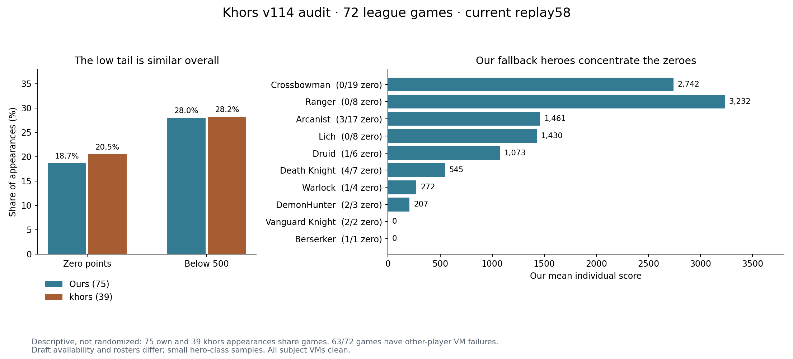

# khors v114: where it earns points and where ours stops earning

Khors leads the captured leaderboard with **2,125.96**, versus Aaron **1,759.46** and Coach **1,680.54**, at September 23, 2026, 13:59:45 UTC. These are cumulative standings after 74 scored rounds, not the means of this audit. The [semantic IR](opponent.ir.json) and [Python MODEL](opponent.py) describe observed behavior. **Khors executable source was unavailable**, so exact internal ordering, memory and thresholds remain unidentified.

## Scoring objective

**Score = floor(max(0, lifetime XP − 200 × elapsed minutes)).** Elapsed time includes drafting. At seven minutes, 1,400 XP yields zero points. At eight minutes, the same XP still yields zero, now with a 200-XP shortfall to break even. Earning exactly 200 XP during that extra minute merely maintains the previous margin.

The goal is to increase XP after subtracting this time cost. Longer games help only when additional XP exceeds 200 per extra minute, and an existing deficit must be recovered before positive points appear. Ending the game can also award 500 XP to every teammate when the enemy god is destroyed; timeouts do not grant that reward. The [actor records](evidence/actor-rows.json) include time cost, unclamped score margin, XP deficit to break even and net XP per minute. These are replay diagnostics; BASIC does not expose raw XP.

## Evidence

All 72 games in the latest three completed platform rounds, 683–685, were frozen before new outcome analysis. They use engine **2026.9.22.3 / replay 58**, commit `1b708944`. Exact khors v114 UUID: `145c01e0-0cbf-4e1e-8120-11b437175b91`; hosted content hash: `e66729cb198ac6a7a398abc529457b24595013d7070210c09e9445ee138ae160`. Our two versions share source `29f6d7e6`. All 72 replays reconstruct every world hash and reconcile final XP and integer scores. Khors appears 39 times, Aaron 38 and Coach 37. Each hero is matched by exact version/player identity; slots are used only for replay indexing and descriptive draft context.

**63 of 72 matches contain other policies with failed VMs. Our subjects and khors have zero VM failures.** The [analysis](evidence/analysis.json) preserves those actual league outcomes and separately reports nine fully clean games. Khors earned 12.54% of its hero XP from slots whose VMs eventually failed, versus about 3.43% for ours. Exact failure times are unknown; we cannot say those kills followed the failure or infer intentional failure detection.

The browser viewer could not create a WebGL context, so this report does not claim visual playback. Evidence comes from the matched simulator, typed events, positions and authentic own-controller reconstruction. The Buff pages were visited, but their player dataset ends on September 22 and includes replay versions 51/56/57; it is historical context only. Prior IRs remain unchanged.

## What khors does well

| Mean per appearance | Ours, pooled 75 | Khors, 39 |
| --- | ---: | ---: |
| Individual score | 1,682.52 | 2,259.56 |
| Hero kills | 10.12 | 14.51 |
| Creep XP | 1,619.05 | 2,325.10 |
| Basic damage to structures | 8,466.28 | 19.00 |
| Deaths | 3.84 | 6.79 |
| Time in match, minutes | 11.41 | 12.74 |

Khors earns more hero and creep XP despite more deaths, and does almost no basic structure damage. This supports a unit-farming emphasis as an observed result. It does **not** establish intentional game extension, a particular target priority or that all structure attacks should be removed from ours. Matches and hero availability differ; teammate and opposing comparisons are separated in the data.

It selected Crossbowman whenever available (12/12), then Ranger whenever available without Crossbowman (6/6). Fallback selection varies between Lich and Druid when both are available, so a universal fixed draft list is not established. Its accepted core equipment progression is dagger (11) → armor (16) → axe (18) → RuneCrossbow (19); 35 of 39 appearances complete it. Our core order is already the same. Earlier text calling item 19 a spellbook should not be carried into this engine.

Khors completed 128 keep-to-field portals in 39 appearances, versus 130 in our 75. That suggests more frequent outbound use, but it also completed 57 keep-to-keep channels and had 23 interruptions. Keep our channel and recall safeguards when testing greater outbound use. Portal purpose and destination quality need separate validation.

## Our low-score situations

**21 of our 75 appearances score below 500, including 14 zeroes.** Melee classes produce nine zeroes in 13 appearances; Crossbowman and Ranger produce none in 27. At the last team draft position, eight of our ten appearances score zero. These are small descriptive strata, and later draft restricts available heroes; slot identity is not a suitable runtime strategy switch.

Khors also scores zero in 8/39 appearances and below 500 in 11/39. Its nonzero mean is **2,842.68**, versus **2,068.67** for ours. Raising our floor is worthwhile, but fewer zeroes do not explain khors's current advantage. We also need more productive play when our hero is functioning.

Four contrasting low cases were selected after the survey and then replayed with our authentic BASIC source. **All 5,826 submitted commands and every world hash match.** These are diagnostic cases, not an independent forecast test.

| Case | Verified outcome | What to test |
| --- | --- | --- |
| [Arcanist, repeated deaths](https://softmax.com/observatory/v2?detail=episode-request:ereq_b2fc0a02-1cf0-4039-9f7c-706c6cf283c5) | 0 points; 453 XP; nine deaths in 9.58 minutes; all VMs clean | Safer low-level engagements and productive reentry after respawn. |
| [Arcanist, little farming](https://softmax.com/observatory/v2?detail=episode-request:ereq_780efe39-9013-4122-8876-ed376507ae53) | 0 points; 1,110 XP including 500 god XP; two deaths; up to 168 seconds without XP | Release an unproductive route and reacquire a reachable wave. |
| [Warlock, survives but scores zero](https://softmax.com/observatory/v2?detail=episode-request:ereq_39c56471-ac42-4d99-80af-0dcd258b74b6) | 0 points; 1,312 XP over 7.08 minutes; no deaths; 4,884 basic structure damage | Protect hero and creep XP opportunities. The time cost was about 1,416 XP, leaving a 104-XP deficit despite surviving and receiving the god reward. |
| [DeathKnight, long healthy droughts](https://softmax.com/observatory/v2?detail=episode-request:ereq_5d0b4a67-b368-440f-9ec6-b5910907c894) | 0 points; 3,176 XP over 20.71 minutes; 405.6 seconds healthy in field after 30 seconds without XP | Recover productive farming instead of repeating an empty advance. The time cost was about 4,142 XP. The drought occupancy is cumulative, not one continuous interval. |

Our source keeps `crossed=1` once it passes the lane waypoint, then uses the enemy-base destination when no higher-priority action stops advance. There is no progress timeout for that commitment. The Warlock case emitted 109 enemy-base attack-moves; DeathKnight emitted 426. No home-directed attack-move occurred in these four cases. This identifies an executed route pattern; it does not prove that a proposed reroute improves score. Stale `bestKind` counters in the raw source probe are excluded as target evidence whenever `bestId=0`.

The drought measure uses true XP. **BASIC exposes no raw XP field.** A live recovery skill must use validated public proxies such as target absence, visible waves, landed-hit history and level/gold changes. Those proxies are not interchangeable with XP.

## Cross-check with clean controlled matches

The [200 previously audited current-source controls](evidence/clean-control-comparison.json) show the same context dependence without failed VMs. These are reused historical fixed-roster diagnostics, not new qualification.

| Our context, 50 games each | Our mean | Opposing khors mean | Our zeroes |
| --- | ---: | ---: | ---: |
| Red, first team pick | 2,945.18 | 2,164.74 | 3 |
| Blue, first team pick | 2,969.76 | 2,382.66 | 6 |
| Red, later team pick | 120.30 | 1,017.32 | 32 |
| Blue, later team pick | 583.06 | 1,827.32 | 11 |

Our early ranged play already outscores khors in these controls. Preserve it while testing recovery conditioned on class and public observations for constrained drafts. Our late heroes and khors's early carries differ, so this table does not isolate the causal effect of draft order or class.

## Implementation handoff

[Counter hypotheses in semantic IR](counter-hypotheses.ir.json) specify public predicates, skills, safeguards and validation:

1. Improve weak melee farming and reentry; avoid repeated low-level deaths.
2. Recover from an unproductive advance by choosing a visible wave or safe alternative destination, with bounds to prevent oscillation.
3. Account for foregone hero and creep XP before extended structure engagement, while preserving valuable god finishes.
4. Use safe outbound portals after recovery or shopping, with protection against redundant channels.
5. Validate ability reach. Ours records roughly 579 out-of-range rejections per appearance versus 6.46 for khors. Rejections alone do not prove lost mana or score; the earlier spell-pressure experiment remains rejected.

Each proposed skill must improve the final XP-minus-time score in a fresh comparison. Fewer deaths, more damage, longer games, extra portals or fewer rejected actions are insufficient by themselves.

No policy was modified, uploaded or deployed, and no new hosted games were purchased. The IR is descriptive and cannot be used as an executable khors surrogate. See [reproduction instructions](../../../../games/gods_of_the_arena/instruments/khors11420260923/README.md), [raw artifact hashes](evidence/artifact-index.json) and [own-controller proofs](evidence/own-source-summary.json).
