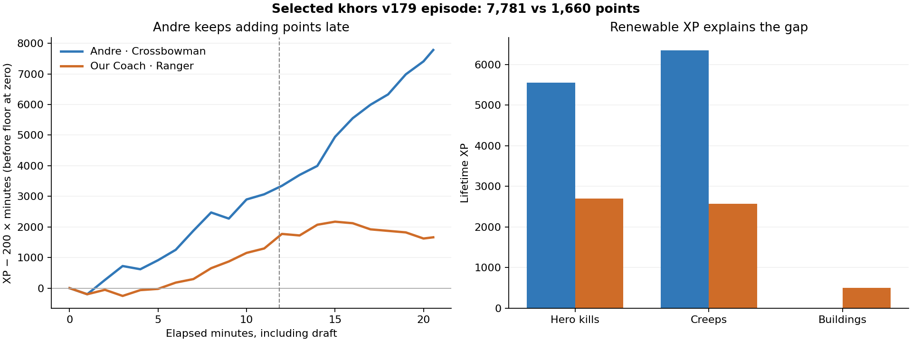

# Why khors v179 scored 7,781

In the [coached episode](https://softmax.com/observatory/v2?tab=overview&detail=episode-request:ereq_e3471c64-b38e-4bfc-927e-e0e3f3076d9d), Andre's Crossbowman earned **11,892 XP** in20.551minutes, paying4,110.14points of elapsed-time cost for a final integer **7,781**. Our Coach's Ranger earned5,771XP and scored1,660. Both source identities, every replay state hash, all ten finalXP totals and integer scores reconcile on published **2026.9.23.1/replay59**, commitd6827a4. Andre's source is unavailable: the [seven-layer semantic IR](opponent.ir.json) describes observed behavior and preserves unidentified guards; it is not an executable proxy.

| Metric | Andre, Crossbowman | Our Coach, Ranger |
|---|---:|---:|
| Final score |7,781|1,660|
| Hero XP |5,550|2,700|
| Creep XP |6,342|2,571|
| Building XP |0|500|
| God reward |0|0|
| Hero kills |37|18|
| Creep last hits |435|181|
| Deliberate building attacks |0/730|328/688(47.7%)|
| Damage to structures |0|18,321|
| Final level |17|12|
| Deaths |9|10|
| Alive field minutes |15.43|15.21|
| Dead minutes |1.10|2.84|
| Last six battle minutes' XP |4,378|600|
| Full battle minutes above200XP |19/20|12/20|
| Out-of-range cast rejections |50|1,328|

The gap is productive use of similar field time, not merely avoiding death or staying outside the keep. Andre gained3,178points of unclamped margin in the final six minutes; Coach lost600. Andre's hero kill XP includes1,200from eight kills of Coach and300from two kills of the player whose VM failed. Removing that300 arithmetically would not remove the score gap, but is not a valid counterfactual rerun.

## Buildings have XP, but barracks also supply future XP

The current source awards**100XP to a hero killing a building**,150per hero kill, and500to every teammate on enemy god destruction. So “buildings give noXP” is incorrect. This match timed out and awarded no god bonus.

Blue destroyed **four of six red barracks**, three last-hit by Coach and one by creeps. IDs49/51 supplied the central lane and41/43 one outer lane. The fourth fell at tick17,055, or11:50.6elapsed. Red still had two barracks in the other outer lane. All six blue barracks survived. Destroyed barracks stop spawning waves; current `spawnWave` emits three melee and one caster per surviving barracks.

Coach earned no creepXP after elapsed minute11. Barracks loss and continued routing into that area are plausible causes, but this replay alone cannot isolate routing, kills, positioning and enemy behavior. Our earlier “all four barracks” commentary was corrected: four were destroyed, two remained elsewhere.

Andre used damaging spells extensively:9,620spell damage to creeps and5,024to heroes, alongside15,255basic creep damage and15,851basic hero damage. His198released spells include93SiegeScarab,40LodestoneSurge,50FinalMeasure and15ClockworkCharge. Submitted manual cast commands and automatic spell releases are different counters; source ordering is not known. His purchases use the same core order as ours:CrimsonDagger→KnightArmor→BattleAxe→RuneCrossbow, with potions and scrolls interleaved. Do not infer an equipment upgrade advantage without timing tests.

## Scope and checks against cherry-picking

The user selected this high-score example. Before decoding more outcomes, we froze the twelve latest other completed current-release khors179 episodes from an existing captured listing. Their mean is**1,642.25**, nonzero mean2,189.67, with **three zeroes**. The7,781game is not a typical-outcome estimate. Twelve of the13audited games have zero basic structure damage; one Arcanist game has170. “Never attacks buildings” is therefore stronger than this evidence supports.

Only two of the other12games have all ten VMs clean; the remaining10and the coached game have another player's VM failure. Khors itself is clean throughout. Keep these contexts visible. Classes, draft positions and teammates differ; the sample is descriptive and not a randomized causal test or validated forecast. Raw XP and full replay truth are diagnostic inputs and cannot enter a live BASIC controller.

Our authentic deployed source also reproduces all **3,235submitted commands** and every state hash for Coach in this episode. This confirms that the analyzed behavior came from our current controller. Its71single-scroll outbound opportunities are diagnostic support for the separately deferred portal hypothesis, not evidence of a score improvement.

## Transfer test and follow-up

[Unit-farming experiment](../../../../games/gods_of_the_arena/experiments/2026-09-23-unit-farming.md) changes only deliberate target eligibility: select observed living enemy heroes/creeps and retain structural observations for safety, defense and navigation. The current host's automatic attack-move acquisition is creeps-only. Incidental area damage can still hit structures. It preserves the entire existing portal/economy/recovery controller and does not import the separately prepared outbound-portal change.

Fresh400-game qualification measures overall score, nonzero mean/frequency and score>=500frequency across both colors and draft contexts. Lost structure/god rewards, tower exposure, longer unproductive games and reduced gold can refute this intervention. Andre moved tov180before this comparison; the opponent model remains explicitlyv179 and the trial freezes independently verified current versions. The completed trial reduced mean score27.58%, with all400games valid and every context lower. Its reviewed IR/policy is [preserved as a rejected candidate](../../../../examples/gods_of_the_arena/players/ir/forks/unit-farming20260923-hosted/README.md). The user then proposed selective short building finishes. That separate400-game comparison also failed its frozen joint rule: mean−1.82%, productive frequency53%→44.5%, while its conditional productive mean rose. Neither candidate was deployed. The [manual coaching audit](../../../coaching/2026-09-23-manual-score/README.md) additionally reconciles accepted potion/portal/buyback spending and200current-engine baseline games; it avoids interpreting every consumable as healing or every rejected cast as a lost spell.

Evidence: [numeric analysis](evidence/analysis.json), [identity and full replay proofs](evidence/verified.json), [XP and purchases](evidence/coached-economy.json), [damage and minute timeline](evidence/coached-combat.json), [structure deaths and commands](evidence/opportunity.json). Captured replay/spec/results/logs and screenshots are preserved under`/Users/aaln/experiments/softmax/polyworld/tmp/gota-khors179-audit-20260923`; hashes bind those inputs. Collection created no hosted games.
