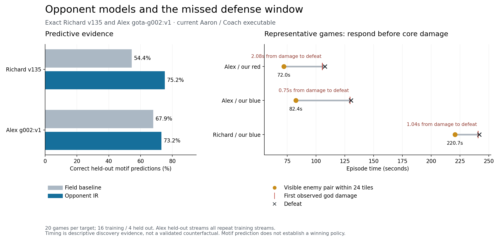

# Richard v135 and Alex g002:v1: opponent IR and counter research

Both exact opponents beat the current Aaron/Coach executable in all 20 selected games each. The most actionable shared defect is in our own strategy: the Jordan counter cancels defense beyond 28 tiles from our god. Alex's larger attack is detected but that commitment is canceled; Richard's late two-hero attack also falls below the normal group alarm. Richard red additionally loses despite some defenders returning, so recall is not a complete solution.

| Opponent | Python IR | Full evidence report | Heldout prediction | Field baseline |
|---|---|---|---:|---:|
| Richard `richard-gods-of-the-arena:v135` | [richard_v135.py](../../../examples/gods_of_the_arena/players/ir/opponents/richard_v135.py) | [Richard analysis](../richard-v135/opponent.ir.md) | 694/923 · 75.2% | 502/923 · 54.4% |
| Alex Smith `gota-g002:v1` | [alex_g002_v1.py](../../../examples/gods_of_the_arena/players/ir/opponents/alex_g002_v1.py) | [Alex analysis](../alex-g002-v1/opponent.ir.md) | 210/287 · 73.2% | 195/287 · 67.9% |

The Python `MODEL` dictionaries use the same situation, belief, goal, skill, strategy, execution and update layers as the primary policy. Strategy records retain `id / when / skill / for`. Belief entries carry exact policy identity, observation counts, confidence, alternatives, provenance and prediction records. `PROPOSED_RULES` are research proposals. These models forecast visible choices; they are not reconstructed private source or validated live opponents for simulation.

## What differs between the opponents

Richard's clearest distinctive targeting preference is structure over creep contact when both are locally available and our heroes are absent nearby. This occurs in 338/583 paired training selections. On heldout starts in that context, its forecast is correct 140/226 times versus 83/226 for the field model. Richard also sustains hero contact in other situations; there is no universal structure-first ordering. Only 18.3% of living opponent hero-ticks are visible to our single observer, so the model makes no claims about the rest.

Alex creates an earlier structure attack. Our sampled losses finish at 107.6 seconds on red and 130.3 on blue, versus 354.9 and 241.8 against Richard. In all 12 distinct Alex training observer streams, the first visible enemy pair within 24 tiles of our god arrives with all five friendly heroes alive farther than 28 tiles away. Alex sometimes prefers structures over a nearby hero (25/33 paired training starts), but prefers hero contact when creeps are also available. Context matters; calling Alex a bot that ignores heroes would misdescribe the evidence.

Richard's heldout set includes novel observer streams; their accuracy is 76.3% versus 50.2% for population. Every Alex heldout stream repeats one from training. Alex's small forecast improvement is descriptive and does not establish generalization. There are only three distinct heldout clusters per target. Repeated trajectories are not independent trials.

## The own-policy defect

The source locations are the blue and red cancellation branches in [jordan268_counter/contracts.py](../../../games/gods_of_the_arena/instruments/jordan268_counter/contracts.py), compiled into each report's archived `observer-policy.bas`. They clear `defActive` and `defUntil` when distance from our god exceeds the configured 28 tiles. This creates an intentional offense-versus-defense tradeoff that worked against Jordan but fails in these observed games.

- Against Alex on red, at tick 2520 all five own VMs report `defCount=5`, `defAnchor=1`, `defActive=0`, `defUntil=0` and attack remote structures. First god damage is at tick 2533; defeat is at tick 2583, just 2.08 seconds later.
- Against Alex on blue, sampled own decisions at tick 3000 show `defCount=4` with inactive defense. First god damage is at 3108; defeat is at 3126, 0.75 seconds later.
- Against Richard on blue, at tick 5760 all five sampled decisions have `defCount=2` and inactive defense. First god damage is at 5778; defeat is at 5803, 1.04 seconds later.
- Richard red is different: several heroes are already defending in the late trace, and we still lose. Early combat, experience and response quality need separate diagnosis.

These are actual samples from our exact source, not inferred enemy VM states. All 93,288 owned commands and every state hash matched across the four representative replays. Samples are every 120 ticks; no memory is interpolated at the damage tick. Macro timing was counted after fitting the target-choice models and is explicitly descriptive discovery evidence.

## Proposed counter experiments

1. **Preserve a bounded critical-defense commitment.** A visible pair threatening a standing home structure/core should be able to override distant cancellation. Determine responders from travel time and local pressure; use only observable state. This targets Richard's small late attack and Alex's detected larger push without removing all counterpressure.
2. **Intercept before the god takes damage.** In these examples the final burn lasts 0.75–2.08 seconds. Test response at a threatened inner structure, and measure actual arrival, survival and enemy structure-target time. A god-HP-only alarm is too late in these games.
3. **Diagnose Richard red separately.** The existing Critical60 variant won 4/4 blue screening games but won 0/4 on red; Critical40 was 2/4 blue and 0/4 red. The tested red equipment-only variant was also 0/4. These results reject sufficiency of those particular repairs, not every defensive approach.

The ongoing single autoresearcher has both exact targets and these findings. It must validate **one executable** against Richard, Alex and Jordan on both colors, preserving broad-field performance. Existing prospective thresholds remain: Richard and Alex at least 30/40 per color, Jordan at least 38/40 per color, fresh controls and existing field gates. No threshold was relaxed based on this analysis. No new policy was deployed by this study; a jointly winning policy remains unresolved.

## Verification and reproducibility

Each target used 16 training games, four chronological heldout games and 14 earlier population games spanning eight other versions. Selection ignored outcome. Training deduplicated exact observer streams; models and extraction semantics were frozen before heldout decoding. The engine is published version 2026.9.16.5, source `f2ab9598d8f8001b6beae3e66404e341770c803f`.

Both [Richard compatibility](../richard-v135/python-compatibility.json) and [Alex compatibility](../alex-g002-v1/python-compatibility.json) reproduce every heldout forecast, verify exact rosters and runtime logs, and show that merging both belief patches into a copy of primary IR preserves the exact deployed BASIC. The action compiler rejects both observational models as executable policies. Eight semantic/visibility tests passed. The [experiment record](../../../games/gods_of_the_arena/experiments/2026-09-20-richard-alex-opponent-ir.md) records the limited predictive verdict; each target report includes a complete artifact hash manifest.
