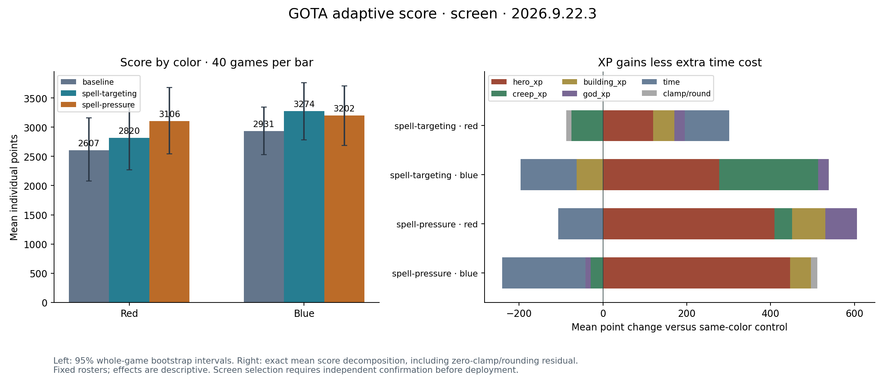

# Adaptive score screen and failed independent confirmation

**Neither broad variant was deployed.** All400 hosted games passed source,
all-player VM, complete replay, XP and integer-score audits. The selected
spell-pressure controller gained13.92% in the initial roster but failed the
independent later-draft comparison (−4.20%, including red−13.35%). The original
portal policy remains deployed. The unselected spell-targeting variant has no
independent confirmation; its IR leaves that claim awaiting review.

| Comparison | Policy | Red mean score | Blue mean score | Overall change |
|---|---|---:|---:|---:|
| Initial screen | Control | 2606.73 | 2930.83 | — |
| Initial screen | Spell targeting | 2820.43 | 3274.15 | +10.06% |
| Initial screen | Spell pressure | 3106.30 | 3202.28 | +13.92% |
| Independent later draft | Control | 1255.13 | 1068.40 | — |
| Independent later draft | Spell pressure | 1087.58 | 1138.28 | −4.20% |

Each bar represents40 games. Bootstrap intervals, duplicate streams, class
mixture, all request IDs and within-game Richard167/khors114 score gaps are in
[evidence](evidence). Crossbowman drove most of the initial gain; the later
draft exercised Arcanist, Lich, Druid and Death Knight. These outcomes motivated
a separately tested class-conditional source, not an automatic splice.

- [Spell targeting IR and source](spell-targeting): reviewed source352b5d93,
  IR3d54fe22. Local mechanism supported; independent competitiveness untested.
- [Spell pressure IR and source](spell-pressure): reviewed source5b693e5c,
  IR3cee05fb. Initial screen passed; independent competitiveness contradicted.

Run each pair's `verify.py` or its portable `convert.py compile/extract`.
All initial local IR snapshots, captured coaching inputs and parent evidence
remain preserved. Edited executable bytes invalidate these results.

