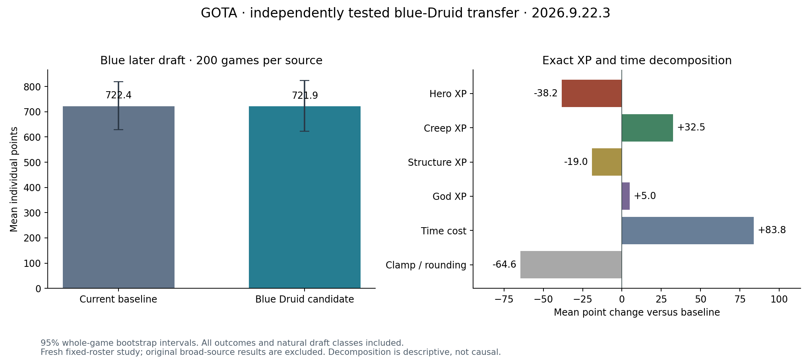

# Richard-focused blue Druid research fork

The coordinated covered-tower pressure and siege-attacker response are integrated into the [semantic IR and generated BASIC pair](blue-druid-siege/). This fork is **saved for research, not deployed**: it improves the relative score against Richard v174 in this setting, but fails the frozen personal-score and khors-gap requirements. Current Druid-lane champions remain live for both players.

## Independent comparison

400 fresh games, 200 per source, blue later-draft ordinal3, fixed mixed roster, engine2026.9.22.3/replay58. All outcomes and natural classes are included. The earlier broad study only generated the hypothesis; none of its games are reused.

| Metric | Current baseline | Scoped candidate |
| --- | ---: | ---: |
| Mean individual score | 722.445 | 721.890 |
| Outscored Richard v174 | 86/200 (43%) | 119/200 (59.5%) |
| Mean own-minus-Richard score | −256.46 | +196.04 |
| Outscored khors v114 | 66/200 | 11/200 |
| Mean own-minus-khors score | −1216.615 | −1935.105 |
| Outscored Jordan v411 | 115/200 | 130/200 |
| Mean lifetime XP | 3215.855 | 3196.130 |
| Mean deaths | 5.28 | 4.84 |

Own-score change is **−0.08%**, with a 95% independent whole-game bootstrap interval of **−17.43% to +21.10%**. The fork does not pass the required +10% gain and positive lower bound. Its worse khors gap also fails relative preservation. These are individual outscore fractions, not team win rates or a lasting rank claim.

The [opponent decomposition](evidence/opponent-decomposition.json) shows why this can look effective against one rival: Richard's mean XP falls by663.88, while Andre's rises by684.53 and ours stays nearly flat. The own-minus-Richard gap improves by452.50 (descriptive 95% interval220.32 to684.65); the own-minus-khors gap worsens by718.49 (interval−1061.19 to−377.02). This does not identify the effect of an individual component or prove literal XP transfer.

## Implemented behavior and validation

Only blue DruidWarden executes the new decisions. With at least65% health, allied creep cover, no tower aggro or local numerical disadvantage, it can prioritize a nearby exposed tower already targeting another actor over a nonlethal creep. Existing last hits, selected heroes/gods, recovery and escape priorities remain. During siege it can select the lowest-HP in-range enemy hero targeting self and synchronize the target fields used by movement and spells. Runtime inputs are public observations, with no opponent-name detector.

All662 local host checks and24 native games pass. Ten unaffected match pairs preserve every command and final world state. All400 hosted games pass ten-policy source identity, VM exit, complete replay-state, XP and integer-score audits. Natural Druid exposure is176/168; the remaining24/32 heroes are DemonHunters. Distinct streams are199/196; repeated streams remain included as prespecified.

The frozen 16-game mechanism subset reconstructs exact subject commands and all state hashes. It records114 covered-tower selections and77 submitted attacks, and zero siege-attacker activations. These counts are not landed damage or isolated causal score contributions. No game-version or principal-champion changes occurred.

The reviewed IR reflects failed qualification; compile/extract round trips reproduce the exact BASIC source. Run `python blue-druid-siege/verify.py` here. Source SHA256: `b7cd11916f0e21eb0dad9b4ca1f8acd956809c0c680ab21bb62696900558b100`; reviewed IR: `d27e4d370185a8fc1b02b94bd5883cee7017f6fbd9476f77742ec367352ded95`.

## Evidence and preservation

- [Complete report](evidence/report.json), [mechanism audit](evidence/effects-summary.json), [raw artifact hashes](evidence/artifact-index.json), and [retained champions](evidence/retained-champions.json).
- [Experiment protocol](../../../../../../games/gods_of_the_arena/experiments/2026-09-23-blue-druid-siege.md) and [Richard source IR](../../../../../../docs/opponents/richard-v174/source-audit-20260923/README.md).
- Original coaching inputs and Richard source are unchanged; see [preservation check](evidence/preserved-input-verification.json). Original failed local revisions and the rejected200-game request are retained under the raw root. The server's100-game maximum required four physical requests, with no change to sample, roster or gates.
- Uploaded name `morrow-jasper-6e52` is opaque and unused in the league. The hosting API has no privacy flag.

Raw root: `/Users/aaln/experiments/softmax/polyworld/tmp/gota-blue-druid-siege-20260923`.
