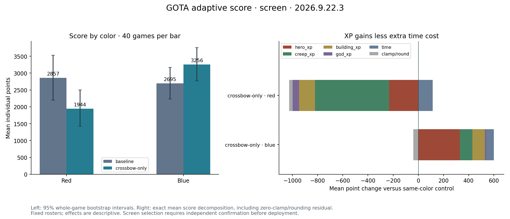

# Crossbow-only score experiment

Rejected after 160 fresh hosted games: mean score 2776.21 → 2600.05 (−6.35%), red −31.94%, blue +20.78%. All games pass source, VM, full-replay and score audits. No league changes.

[Reviewed IR/source pair](crossbow-only/README.md), [experiment](evidence/experiment.md), [full score report](evidence/screen/report.json). The game and champion versions remained stable. The failed red cell prevents deployment despite the blue gain.

The original local pair and captured inputs remain preserved outside Git; evidence/artifact-index.json records their hashes.
