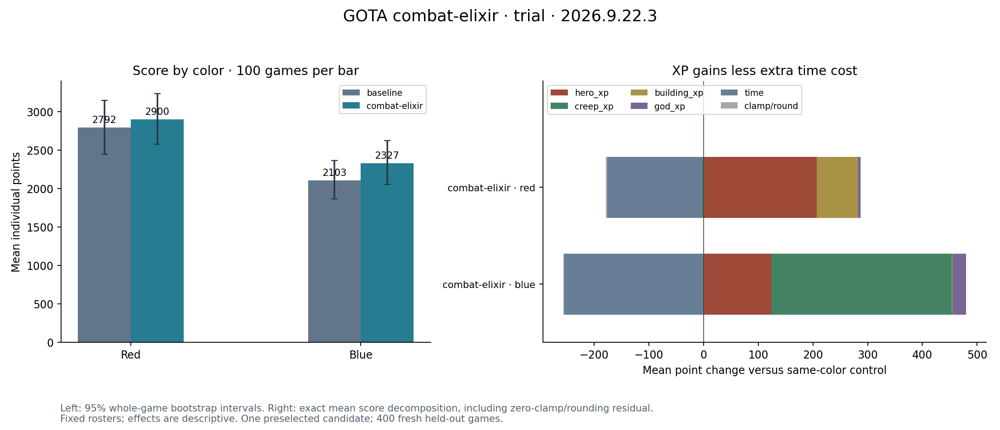

# Combat elixir comparison

400 fresh games: score2447.32→2613.44 (+6.79%), red+3.88%,blue+10.64%.
95%gain interval[−5.39%,+20.87%]. All audits pass; blue candidate99distinct
streams/100. Rejected from deployment: aggregate10% and positive lower-bound
gates failed. Richard also changed167→174. Both portal champions remain.

[Reviewed IR/source pair](combat-elixir/README.md), [full report](evidence/trial/report.json),
[experiment](evidence/experiment.md). Hero XP increased both colors, but deaths
also increased and games grew longer; this is not established better survival.

