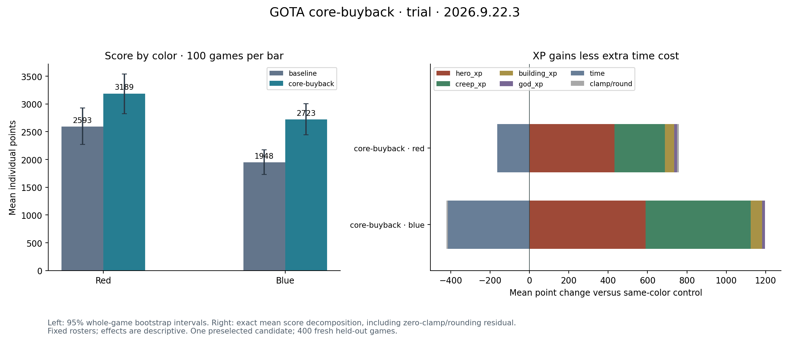

# Core buyback: validated individual-score policy

The complete candidate increases average individual score **30.18%** over fresh
deployed-source controls on game2026.9.22.3: **2270.46 → 2955.775**.
The95% side-stratified independent whole-game bootstrap interval is
**+16.10% to +46.54%**. All400games pass all-ten source/VM, full replay hashes,
XP-source decomposition and integer-score checks. Game and champion snapshots
remained stable throughout the trial.

| Result | Red | Blue |
|---|---:|---:|
| Control mean points |2593.28|1947.64|
| Candidate mean points |3189.01|2722.54|
| Gain |+22.97%|+39.79%|
| Outscores Andre khors114 |64/100|36/100|
| Outscores Richard174 |78/100|82/100|
| Outscores Jordan411 |79/100|87/100|

The [portable IR/policy pair](core-buyback/README.md) changes the lifecycle skill.
After buying dagger11, armor16, axe18 and crossbow19, buy back when more than
five seconds remain and gold covers the price plus100. Before completing that
core, preserve the original25second/200reserve rule. The current engine grows
respawn time with death count, not level; gold has no direct score reward.
Only this complete candidate was evaluated. Draft, attacks, spells, farming,
shopping and inherited portal coaching retain their original executable bodies.

All180 actual-tick buyback scenarios across ten classes/two colors pass,
as do84portal and126broader host checks. Eight full native games validate
runtime and replay reconstruction, not competitive advantage. Sixteen
prospectively selected effect replays show accepted buybacks activating;
they are class-imbalanced diagnostics, not an independent score test.

The frozen [protocol and final analysis](evidence/experiment.md),
[full report](evidence/trial/report.json), [effect diagnostics](evidence/trial/effects-summary.json)
and [requests/source inventory](evidence/artifact-index.json) preserve exact
provenance. Original local pair and captures remain under
`polyworld/tmp/gota-core-buyback-20260923`; the earlier portal coaching session
and rejected experiments remain preserved. Reviewed IR feedback compiles to
identical hosted source **67fdcd5d0e8692138655c5f5ca93c98ec723690665eb1ca0fe412cb630a99024**.

Two cells contain one duplicate stream each(99/100); seeds are unmatched.
This is a fixed first-team-seat mixed-roster result. Andre's blue mean gap
remains−161.49(CI−531.83to+216.27); both-color superiority and future#1rank
are unproven. The candidate outscores him100/200overall and Richard160/200.
Deaths increase on both colors; the result supports higher points, not fewer deaths.

[Deployment and rollback receipts](../core-buyback20260923-deployment/README.md)
record placement separately. Run `python core-buyback/verify.py` to verify
portable compilation/extraction, source/IR and sealed artifact hashes.
