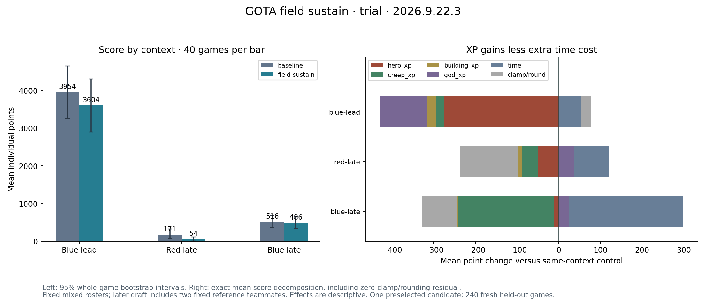

# Field sustain coaching: tested, not promoted

The coordinated coaching policy failed its frozen 240-game score gate. Both
league players retain [blue-center](../blue-center20260923-hosted/README.md).
All local, runtime and hosted replay audits pass; correct recovery behavior did
not establish a competitive improvement.

| Context | Baseline mean score | Candidate mean score | Change |
|---|---:|---:|---:|
| Blue lead | 3,954.48 | 3,603.70 | −8.87% |
| Red later draft | 170.93 | 53.80 | −68.52% |
| Blue later draft | 516.28 | 486.20 | −5.83% |
| Equal-context aggregate | 1,547.23 | 1,381.23 | −10.73% |

Each cell has 40 fresh games per source and 40 distinct command streams. The
aggregate gain's 95% bootstrap interval is −30.33% to +13.17%. All three contexts
miss the 95% preservation floor; the aggregate improvement criterion also fails.
The exposure floor passes with 61 baseline and 70 candidate Druid games. The
fixed roster faces khors:v114, Richard:v174 and Jordan:v411. Later-draft contexts
use two fixed reference teammates to exercise the unchanged Druid fallback.
These results do not imply a universal ranking or isolate any single edit.

## Coaching and implementation

The [verified recording review](../../../../../../docs/coaching/2026-09-23-field-sustain/README.md)
identifies a Druid that heals above 75% HP but follows its old base path for
another 45 seconds. Original captures are preserved without filling in their
empty input IR or policy files. Episode and policy identity were subsequently
verified from the replay and runtime spec; this evidence did not change the
frozen source or evaluation criteria.

The candidate coordinates semantic situation, belief, strategy and skill
changes with explicit binding contracts: evaluate danger and healing resources,
cast an available useful self-heal, stay briefly near allied cover, then cancel
a health-only base route after sufficient recovery. Shopping, danger, resources
and active portal channels retain their guards. The initial failure that treated
the hero's own healing warning as hostile is preserved in `initial-r1`.

All 558 local checks and 12 complete native games pass. Twenty-four mechanically
selected hosted replays show less healthy homeward travel and more field
healing. Those small diagnostic samples are not an independent score holdout.
Competitive claims are marked unsuccessful in the reviewed IR while supported
mechanism claims are retained. A narrower interruption-only hypothesis remains
untested; this exact bundle should not be repeated unchanged.

## Reproduce and inspect

- [Reviewed semantic IR](field-sustain/policy.ir.json), [generated BASIC](field-sustain/policy.bas), and [manifest](field-sustain/manifest.json).
- [Frozen experiment](evidence/prospective-experiment.md), [completed report](evidence/trial/report.json), and [effects audit](evidence/trial/effects-summary.json).
- [Capture hashes](evidence/session-input-manifest.json), [episode binding](evidence/coaching-episode-binding.json), and [raw artifact index](evidence/artifact-index.json).

Run `python field-sustain/verify.py`. From the pair directory,
`python convert.py compile --out /new/path` regenerates the policy and
`python convert.py extract --source policy.bas --out /new/path` extracts its IR.
The reviewed semantic claims round-trip to the exact hosted BASIC bytes.

Source SHA256: `3807330dfedef2756b6874f9758dcf4452ef240c635db84485e347bb9a9b6281`.
Reviewed IR SHA256: `205918cd97b4e0354c88068a263183cf8b4fb4c665be021ea358c53b0fbf4636`.
Binding: `gota-bassy/field-sustain-2026-09-23-r2`.
Engine: `2026.9.22.3`, commit `1b70894436b7ffdcd0d421b6b32c2415c9c8bfde`.
Raw evidence stays at `polyworld/tmp/gota-field-sustain-20260923`; authenticated
artifacts are indexed locally rather than published with access credentials.
