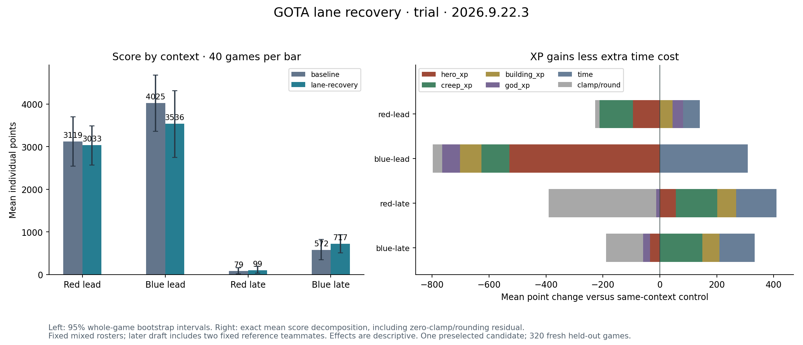

# Lane recovery: full bundle rejected

The 320-game comparison failed its original deployment rule. Both players retain
blue-center. All source, VM, replay, XP and integer-score audits passed; this is
a competitive rejection, not a runtime failure.

| Context | Baseline score | Candidate score | Change |
|---|---:|---:|---:|
| Red lead | 3,119.13 | 3,033.23 | −2.75% |
| Blue lead | 4,024.58 | 3,535.55 | −12.15% |
| Red later draft | 79.08 | 99.20 | +25.45% |
| Blue later draft | 572.30 | 717.38 | +25.35% |
| Equal-context aggregate | 1,948.77 | 1,846.34 | −5.26% |

The aggregate 95% gain interval is −20.51% to +12.25%. Every cell has 40 fresh
games per source and 40 distinct command streams. Druid exposure is 66 baseline
and 71 candidate games. The field remained stable. Later-draft improvement does
not qualify the full source; a class-specific policy needs its own fresh test.

The change holds a safe health-only retreat in lane for useful healing, allows
brief cooldown waiting, cancels the old base path after recovery and preserves
affordable core-item shopping. The 32 diagnostic replays show reduced recovered
homeward travel. These small descriptive samples are not independent score tests.

Read the [complete report](evidence/report.json), [effects audit](evidence/effects-summary.json),
[reviewed IR](lane-recovery/policy.ir.json), [generated BASIC](lane-recovery/policy.bas)
and [manifest](lane-recovery/manifest.json). The [local snapshot](../lane-recovery20260923-local/README.md)
preserves the initial IR, 582 checks, 16 native matches and fixture corrections.
Run `python lane-recovery/verify.py`; the portable converter regenerates exactly
the hosted source bytes. Original coaching captures remain unchanged.

Raw evidence: `polyworld/tmp/gota-lane-recovery-20260923`.
