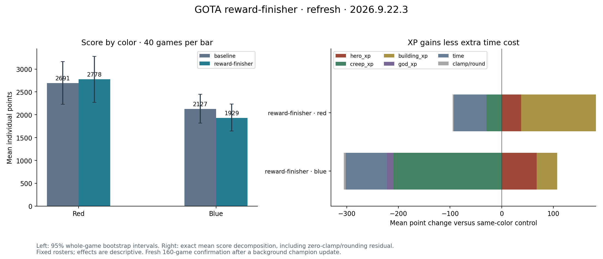

# Refreshed reward-finisher comparison

Rejected:160 fresh games, mean score2409.04→2353.71 (−2.30%), red+3.26%,blue−9.32%.
95% gain interval[−17.59%,+15.59%]. All160 source/VM/replay/XP checks pass;
all cells have40distinct streams. Game and champion versions stayed fixed.
Both portal champions remain deployed.

[Reviewed portable pair](reward-finisher/README.md), [full report](evidence/refresh/report.json),
[experiment](evidence/experiment.md). Original400-game score gain and its
field failure remain preserved separately. These results do not establish
that the finishing source improves the current field.

