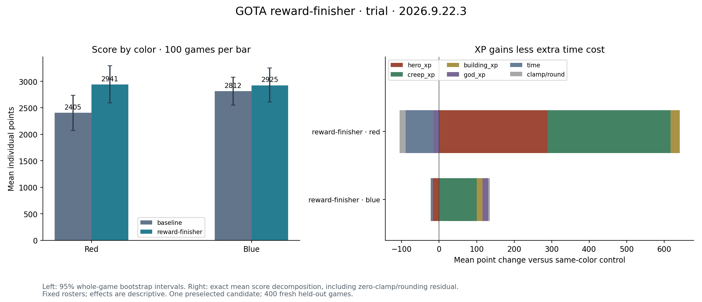

# Reward-finishing trial

400 fresh games: mean score +12.44%, red +22.29%, blue +4.01%; 95% gain interval [+0.084%, +26.409%]. All game audits pass, with one repeated red candidate command stream. The original score gate passes; the all-field stability condition fails after Julia changes champions. No deployment from this trial alone.

[Reviewed IR/source pair](reward-finisher/README.md), [experiment](evidence/experiment.md), [full report](evidence/trial/report.json). Original local IR and all captured inputs remain preserved.

